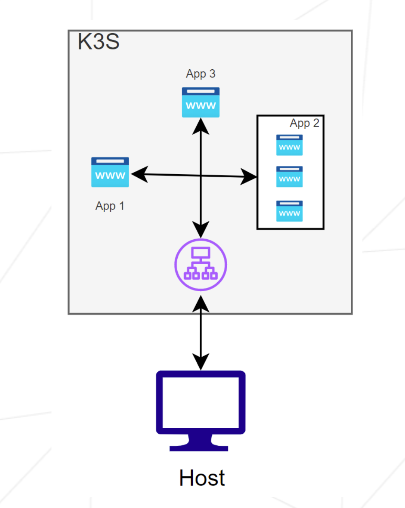

# Parte 2: K3s y 3 Aplicaciones Web Básicas


A diferencia de la Parte 1 (donde desplegamos un clúster multi-nodo con Server y Worker), los requerimientos de la Parte 2 especifican la creación de **un único nodo maestro (`mlezcanoS`)**:

- **IP del servidor**: `192.168.56.110` (red privada).
- **Nombre de la VM**: `mlezcanoS` (siguiendo la nomenclatura del *Subject*: `<login>S`).
- **Rol del nodo**: Servidor K3s único (Control Plane y ejecutor de Pods).

---

## Conceptos Clave

En la Parte 1 levantamos la infraestructura base (los Nodos). En esta Parte 2 damos el salto a desplegar aplicaciones dentro del clúster conectando los objetos nativos de Kubernetes en diferentes capas de abstracción:

1. **Deployment**: Define el estado deseado de la aplicación. Le indica a Kubernetes qué contenedor usar y cuántas copias (*réplicas*) mantener activas. Si un Pod falla, Kubernetes lo recrea automáticamente. Para cumplir con los requisitos del *Subject*, el Deployment de **`App2` cuenta con 3 réplicas** paralelas.

2. **ReplicaSet**: el Deployment no gestiona los Pods directamente, por debajo crea y delega en un ReplicaSet, que es quien realmente vigila que el número de réplicas activas coincida con lo declarado y recrea Pods si alguno muere. Se ve comparando ambos: `kubectl get deploy` muestra `READY`/`UP-TO-DATE`/`AVAILABLE`, mientras que `kubectl get rs` expone directamente `DESIRED`/`CURRENT`/`READY` el número de réplicas que el Deployment le ha delegado. Kubernetes lo gestiona en cascada desde el Deployment.

3. **Service (ClusterIP)**: Proporciona un punto de acceso estable a la aplicación. Dado que los Pods son efímeros y cambian de IP al reiniciarse, el Service le asigna una IP virtual fija, un nombre DNS interno (ej. `app1-service.default.svc`) y **balancea el tráfico internamente** entre todas las réplicas del Deployment (ver `kubetctl get all -n kube-system`).

4. **Ingress (Traefik)**: Es el punto de entrada unificado al clúster (Proxy Inverso, balanceador de carga y enrutador). Escucha el tráfico que llega al nodo y, analizando el dominio o la cabecera `Host` de la petición HTTP, encamina la solicitud hacia el `Service` correspondiente (`App1`, `App2` o `App3`). K3s utiliza **Traefik** como su controlador de Ingress por defecto.

---

## Requisitos de la Práctica



- Una única máquina `mlezcanoS` (`192.168.56.110`) actuando de Server.

- Tres aplicaciones web corriendo.

- Ingress configurado para:
  - `app1.com` -> Dirige a la Aplicación 1
  - `app2.com` -> Dirige a la Aplicación 2 (3 réplicas)
  - Cualquier otro host -> Dirige a la Aplicación 3 por defecto.

---

## Checklist de verificaciónes previas

1. **Interfaz de red `eth1` y su IP**

   - Ejecutando `vagrant status` esta vez podemos ver la única VM requerida por el subject `mlezcanoS`.
   - Entramos al Server con `vagrant ssh mlezcanoS` (ssh sin contraseña como requiere el subject).
   - Ejecutamos `ip addr show eth1` y comprobamos que la IP es `192.168.56.110` como requiere el subject.

---

2. **Hostname**

   - Dentro de la VM ejecutamos `hostname` y comprobamos que devuelve `mlezcanoS`.

---

3. **Comprobaciones y comandos `kubectl` útiles**

	- Desde la VM ejecutamos `kubectl cluster-info` para ver el cluster.
	- Desde la VM ejecutamos `kubectl get nodes -o wide` para ver los nodes: debe aparecer el nombre del controller (`mlezcanoS`) en estado `Ready`, junto con su columna `INTERNAL-IP` (`192.168.56.110`).
	- Desde la VM ejecutamos `kubectl get all -n kube-system` para listar de un vistazo **todos** los recursos del namespace de sistema (Pods, Deployments, ReplicaSets, Services y Jobs de CoreDNS/Traefik/metrics-server/local-path-provisioner), no solo los Pods.

	*- Son las mismas comprobaciones que hemos hecho en /p1 (allí usamos `get pods -n kube-system`; aquí usamos `get all` para ver también Deployments/ReplicaSets/Services/Jobs en una sola tabla)*

---

6. **Como inspeccionar deployments, réplicas y pods**

   - **Comprobación de el deployment:** Ejecutamos `kubectl get deploy` y verificamos que la columna `READY` marque `1/1` para `app1` y `app3` (una réplica por app), y **`3/3` para `app2`** (3 réplicas).

   - **ReplicaSet que hay detrás de cada Deployment:** Ejecutamos `kubectl get rs` — por cada Deployment aparece un ReplicaSet (`app2-xxxxxxxxxx`) con las mismas columnas `DESIRED`/`CURRENT`/`READY`. Es el objeto que Kubernetes crea automáticamente y que realmente vigila el número de Pods vivos. El Deployment solo gestiona ese ReplicaSet.

   - **Vista de los Pods individuales:** Con `kubectl get pods`, comprobamos la lista activa: 1 Pod de `app1`, 3 Pods de `app2` y 1 Pod de `app3`. Con `kubectl get pods -o wide` podemos ver como todos están dentro del mismo nodo, la IP etc...

   - **Eventos a nivel de deployment (para diagnóstico de errores):** Si `app2` no alcanzara las 3 réplicas listas, podemos inspeccionar los eventos del recurso para identificar el problema ejecutando `kubectl describe deployment app2`

	- **Inspección de logs en un pod:** Si ejecutamos `kubectl logs -f <NAME>` donde `NAME` ponemos el nombre del pod que queremos inspeccionar, podemos ver sus logs. El `NAME` lo obtenemos al hacer `kubectl get pods` (algo como "app1-84bc549d9d-8wvkq"). 

---

7. **Verificaciones del Ingress y enrutamiento por cabecera `Host`**

   - **Comprobación de la regla de Ingress:** Ejecutamos `kubectl get ingress` en la VM para confirmar que el recurso está activo y asociado a la IP `192.168.56.110`.

     ```bash
     vagrant@mlezcanoS:~$ kubectl get ingress
     NAME          CLASS     HOSTS               ADDRESS          PORTS   AGE
     iot-ingress   traefik   app1.com,app2.com   192.168.56.110   80      73m
     vagrant@mlezcanoS:~$
     ```

     **Por qué no aparece `app3.com` en `HOSTS`?** 
	 
	 Porque no existe tal dominio: la regla de `app3` en [ingress.yaml](confs/ingress.yaml) es la única que **no** lleva `host:` (es el catch-all para "cualquier otro host" que pide el subject). 
	 
	 La columna `HOSTS` de `kubectl get ingress` solo lista los hostnames explícitos definidos en las reglas — como la regla de `app3` no tiene ninguno, no añade nada a esa columna, aunque sigue activa dentro del mismo recurso `iot-ingress` (una sola `Ingress` puede agrupar varias reglas). 
	 
	 Se puede comprobar con `kubectl describe ingress iot-ingress`, donde sí se ve la tercera regla con el host vacío (`*`) apuntando a `app3`.

	 *Más abajo lo comprobaremos con el propio navegador.*
   
   - **Configuración en el Host (ATENCIÓN: no funciona si no tenemos permiso para modificarlo):** 
   
   Para poder probar la navegación directamente desde nuestro navegador web, podemos añadir las entradas DNS en el archivo `/etc/hosts` de nuestra máquina física:
     ```text
     192.168.56.110  app1.com app2.com app3.com
     ```

	- **Navegación con `app1.com`/`app2.com`/`app3.com` sin editar `/etc/hosts`:** 
	
	Si no tenemos permisos para modificar `/etc/hosts` (ej. en los equipos del campus), podemos lanzar Chrome con una regla de resolución de nombres solo para esa sesión del navegador:

	  ```bash
	  open -a "Google Chrome" --args --host-resolver-rules="MAP app1.com 192.168.56.110, MAP app2.com 192.168.56.110, MAP app3.com 192.168.56.110"
	  ```

	  ***Debemos cerrar antes todas las ventanas de Chrome para que el flag se aplique.***

	- **Comprobación real del catch-all de (con un host que no sea `app3.com`):**
	
	Para demostrar que el Ingress enruta *cualquier* host no reconocido a `app3` (y no solo ese dominio en concreto), mapeamos uno inventado, sin relación con `app1`/`app2`/`app3`:

	  ```bash
	  open -a "Google Chrome" --args --host-resolver-rules="MAP testcatch.test 192.168.56.110"
	  ```

	  Cerramos antes todas las ventanas de Chrome y navegamos a `http://testcatch.test`. Como ese host no coincide con ninguna regla explícita del Ingress, cae en la regla sin `host:` y debe mostrar igualmente "Hello from app3".

	- **Alternativa mediante Header Editor (si no podemos lanzar Chrome con flags):** 
	
	Podemos instalar la extensión **Header Editor** en el navegador, crearemos una regla nueva con esta configuración:

	  - **Tipo de regla:** `Modify request header`.
	  - **Match type:** marca `Dominio` e introduce `192.168.56.110`.
	  - **Execution → Request headers:** añadimos una entrada `host` → `app1.com` (o `app2.com` para la otra app).
	  - Guardamos la regla y comprobamos que queda **activada** (interruptor en el listado principal de reglas).
	  - Navegamos directamente a `http://192.168.56.110`; Traefik interpretará la cabecera `Host` inyectada e mostrará la web correspondiente.

	  A tener en cuenta:
	  - Como las reglas de `app1.com` y `app2.com` apuntan al mismo dominio de destino (`192.168.56.110`), **no pueden estar activas a la vez** (se pisarían entre sí). Hay que crear una regla por app y activa solo la que quieras probar en cada momento.
	  - **Caché del navegador:** si tras cambiar de regla activa seguimos viendo la app anterior, fuerza una recarga con `Control+Shift+R` (o desactivaremos la caché desde las DevTools → pestaña Network), ya que el navegador puede servir la respuesta cacheada sin llegar a aplicar la nueva cabecera.

   - **Validación del enrutamiento vía CLI:** Probamos el comportamiento del Ingress enviando peticiones con la cabecera `Host` directamente contra la IP del servidor. Cada dominio debe responder con el contenido HTML de su respectiva aplicación (`App1`, `App2` o `App3`).

     ```bash
     curl -H "Host: app1.com" http://192.168.56.110
     curl -H "Host: app2.com" http://192.168.56.110
     curl -H "Host: app3.com" http://192.168.56.110
     ```
   - **Verificación del balanceo de carga en App2:** Para comprobar que Traefik y el Service distribuyen el tráfico entre las 3 réplicas del Deployment, podemos ejecutar el siguiente bucle desde la terminal anfitriona:

     ```bash
     for i in {1..6}; do curl -s -H "Host: app2.com" [http://192.168.56.110](http://192.168.56.110) | grep -o 'app2-[a-z0-9]\{10\}-[a-z0-9]\{5\}'; done
     ```

     Este comando realiza 6 peticiones consecutivas extrayendo el nombre exacto del Pod que responde. Al comparar los sufijos aleatorios generados por Kubernetes (ej. `app2-575f644dc8-8xt8n`, `...-fzrtn`, `...-rxjk2`), se confirma visualmente que las solicitudes son atendidas por diferentes réplicas de forma balanceada.

---

8. **Comandos de limpieza y recreación de vagrant**

- Apagar las máquinas (SIN destruirlas): `vagrant halt`
- Si queremos volver a arrancarlas tras detenerlaspodemos hacer otra vez `vagrant up`.

- **DESTRUIR por completo el clúster:**

  ```bash
  vagrant destroy -f
  ```
  
- El flag `-f` sirve para no tener que estar confirmando la destrucción de cada nodo de forma manual (full).
