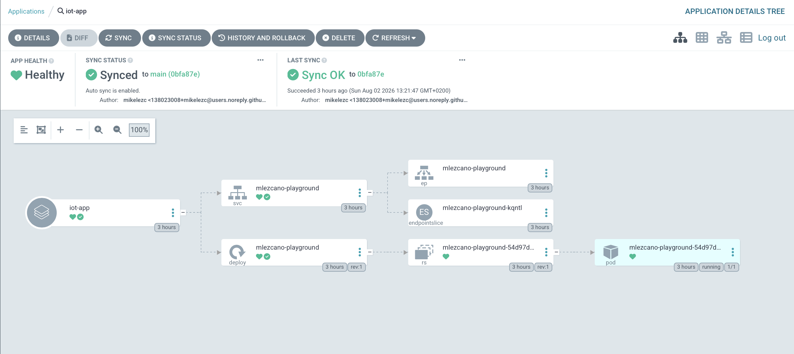
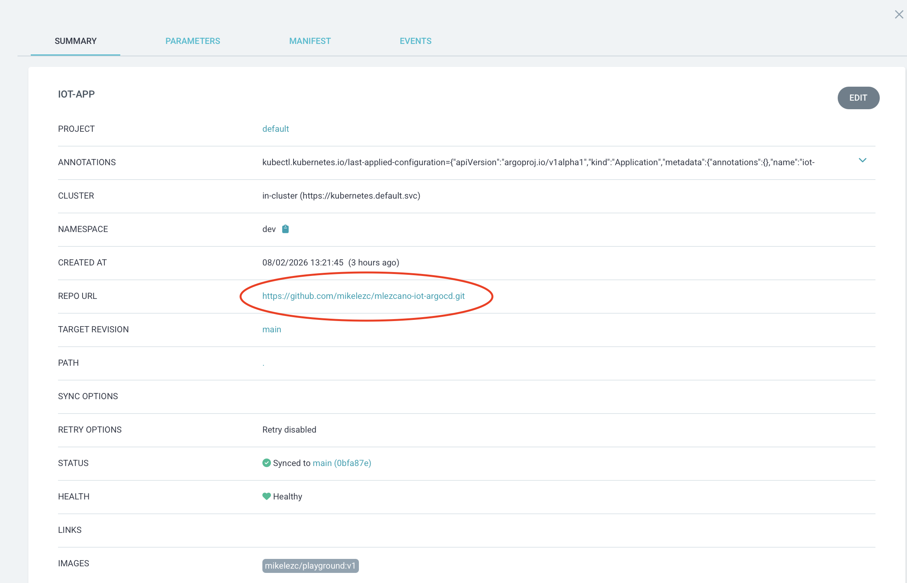

# Parte 3: K3d y Argo CD

En la Parte 2 provisionamos con Vagrant una única VM y desplegábamos las aplicaciones contra un `Ingress` fijo. En esta Parte 3 el enunciado pide justo lo contrario: nada de Vagrant, y las aplicaciones se mantienen sincronizadas de forma automática, gestionadas a través un controlador **GitOps** (Argo CD) que vigila un repositorio Git.

Para esto se nos pide también cambiar la herramienta de clúster: en vez de instalar K3s como servicio dentro de una VM, usamos **K3d**, que ejecuta K3s dentro de contenedores Docker. 

El flujo completo quedaría de la siguiente manera:

1. Levantamos un clúster K3d (K3s corriendo en contenedores, sin VM).
2. Instalamos Argo CD dentro del clúster.
3. Argo CD observa un repositorio de GitHub público con los manifiestos.
4. Cuando cambia el manifiesto en GitHub, Argo CD reconcilia y aplica el estado deseado en el clúster.
5. La app se publica con una imagen en Docker Hub y se sirve en `localhost:8888`.

```
GitHub (estado deseado) -> Argo CD (reconciliación) -> Cluster (estado real)
```

---

## Conceptos Clave

1. **K3s vs K3d**: K3s es la distribución ligera de Kubernetes en sí; en las Partes 1 y 2 la instalamos directamente dentro de una VM. K3d es un *wrapper* que ejecuta ese mismo K3s dentro de contenedores Docker: cada "nodo" del clúster es, en realidad, un contenedor. El único prerrequisito real es tener Docker funcionando, por lo que un clúster completo arranca y se destruye sin provisionar ni mantener una VM dedicada.

2. **Namespace**: partición lógica del clúster para organizar y aislar recursos. En esta parte usamos dos: `argocd` (donde vive el propio controlador) y `dev` (donde Argo CD despliega nuestra aplicación).

3. **GitOps**: paradigma en el que un repositorio Git es la única fuente de verdad del estado deseado de la infraestructura. Nadie ejecuta `kubectl apply` a mano: se edita el manifiesto, se hace commit y push, y un controlador dentro del clúster (aquí, Argo CD) se encarga de que el estado real converja con lo declarado en el repo.

4. **Manifiesto (manifest)**: fichero YAML declarativo que describe un recurso de Kubernetes (`Deployment`, `Application`...). En GitOps, el manifiesto en Git es la "orden de trabajo"; el clúster solo refleja lo que ese fichero dice.

5. **Argo CD y su objeto `Application`**: es el controlador GitOps del proyecto. Corre dentro del propio clúster y usa un CRD llamado `Application` (nuestro `confs/argocd.yaml`) para saber qué repo vigilar, en qué `namespace` desplegar y con qué política de sincronización. En la UI, `Sync` indica si el clúster coincide con el repo y `Health` si los recursos desplegados están realmente sanos.

	*Un CRD (Custom Resource Definition, o Definición de Recurso Personalizado) es una característica de Kubernetes que nos permite extender la API nativa de Kubernetes creando nuestros propios tipos de objetos personalizados.*

6. **Tagging de imágenes**: versionar una imagen Docker asignándole una etiqueta (`v1`, `v2`). Aquí es lo que distingue una versión de la app de la otra; cambiar de versión es tan simple como cambiar el tag en el manifiesto.

7. **Bootstrap**: script (`scripts/install.sh`) que automatiza de principio a fin la creación del entorno: instala dependencias, crea el clúster K3d, instala Argo CD y aplica la `Application`. Es idempotente: se puede volver a ejecutar sin dejar el clúster en un estado inconsistente.

8. **Docker outside of Docker (DooD)**: patrón que usa nuestro `toolbox/` para dar `kubectl`/`k3d` en máquinas sin privilegios. En vez de correr un daemon Docker anidado dentro del contenedor (*Docker in Docker*), montamos el socket del Docker del host (`/var/run/docker.sock`). Así, los contenedores que crea K3d los lanza el Docker real del host, no uno anidado, y los puertos publicados quedan accesibles en el `localhost` de la máquina exactamente igual que sin el toolbox.

---

## Requisitos de la Práctica

- **Clúster**: `K3d` con namespaces `argocd` y `dev`.

- **Argo CD**: instalado en el clúster y accesible desde el navegador (GUI).

- **Namespace `dev`**: contiene la aplicación, desplegada por Argo CD (que vive en el namespace `argocd`).

- **Repositorio GitHub**: el manifiesto de la aplicación vive en un repo público con el login de un miembro del equipo en el nombre. Argo CD lo toma de ahí y lo mantiene sincronizado.
  - `https://github.com/mikelezc/mlezcano-iot-argocd`

- **Imagen Docker Hub**: la app tiene dos versiones. Se puede usar la imagen de Wil o una propia; en nuestro caso la hemos creado y publicado en un repositorio propio ya que al desarrollar parte del proyecto en equipos ARM (Mac Mx), nos era imposible usar las imágenes de ejemplo proporcionadas.
  - `https://hub.docker.com/r/mikelezc/playground`

- **Tags**: `v1` y `v2` publicados en Docker Hub, con diferencias visuales entre versiones para reconocer el cambio a simple vista.

- **Demostración**: cambio de versión `v1` -> `v2` mediante commit/push en GitHub, sin tocar el clúster a mano.

---

## Contenido de la carpeta

1. [scripts/install.sh](scripts/install.sh): bootstrap principal. Instala dependencias, crea el clúster, instala Argo CD y aplica la `Application`.

2. [confs/argocd.yaml](confs/argocd.yaml): manifiesto de la `Application` de Argo CD (repo, rama, path y política de sincronización).

3. [repo-github/deployment.yaml](repo-github/deployment.yaml): **copia de referencia, no está en uso**. Ningún script de esta carpeta lo lee ni lo aplica; se guarda aquí solo como muestra para poder revisarlo sin salir del repositorio. El manifiesto real, el que Argo CD monitoriza y aplica en el clúster, vive en el repo de GitHub:
   - `https://github.com/mikelezc/mlezcano-iot-argocd`

4. [repo-dockerhub/app.py](repo-dockerhub/app.py) y [repo-dockerhub/Dockerfile](repo-dockerhub/Dockerfile): **copia de referencia, no está en uso**. Es el código fuente y la receta con la que se construyó, una única vez y de forma manual, la imagen que sí corre en el clúster. Lo que descarga y ejecuta el `Deployment` es la imagen ya construida en Docker Hub, no este código:
   - `https://hub.docker.com/r/mikelezc/playground`

5. [toolbox/](toolbox/): imagen Docker con `kubectl`/`k3d` ya instalados, para máquinas sin privilegios de host (ver más abajo cuando lleguemos a la sección de arranque del proyecto).

---

## Requisitos previos

1. Docker Desktop (o daemon Docker) activo.

2. Acceso a GitHub y a un repositorio público con el login de un miembro del equipo en el nombre.
   - `https://github.com/mikelezc/mlezcano-iot-argocd`

3. Imagen pública en Docker Hub con el login de un miembro del equipo, por ejemplo `mikelezc/playground`.
   - `https://hub.docker.com/r/mikelezc/playground`

   Hemos construido la aplicación, la hemos metido en un contenedor y la hemos subido a Docker Hub manualmente, ya que el proyecto se ha desarrollado en un Mac con M4 Pro y necesitábamos una imagen multi-arquitectura que se pudiera desplegar tanto en máquinas AMD como ARM.

4. Tags publicados en Docker Hub: `v1` y `v2`.

---

## Arranque de infraestructura

Desde `p3/`, con privilegios de root:

```bash
./scripts/install.sh
```

El script detecta el sistema operativo (`Darwin`/`Linux`), instala Docker/`kubectl`/`k3d` si faltan (con `sudo`), crea el clúster K3d, instala Argo CD y aplica la `Application`.

---

### Alternativa sin privilegios de host

Si no hay privilegios para instalar `kubectl`/`k3d` en el sistema, usamos el toolbox en `toolbox/`: una imagen Docker con ambos ya instalados, que se ejecuta montando el socket de Docker del host (`-v /var/run/docker.sock:/var/run/docker.sock`) y con `--network host`. El clúster K3d se crea igual como contenedores del Docker del host (no anidados), y los puertos publicados (8080, 8888) quedan accesibles en el `localhost` real de la máquina, exactamente igual que con la instalación directa.

`scripts/install.sh` no cambia: sus comprobaciones `command -v kubectl/k3d` encuentran los binarios ya presentes en la imagen del toolbox y omiten la instalación.

```bash
./toolbox/run.sh ./scripts/install.sh
```

También sirve para lanzar comandos sueltos con las herramientas ya listas:

```bash
./toolbox/run.sh kubectl get pods -n dev
./toolbox/run.sh   # shell interactiva con kubectl/k3d/docker(cliente)/git/jq
```

---

Al terminar el script veremos lo siguiente:

- Argo CD: `http://localhost:8080`
- App: `http://localhost:8888`
- Usuario Argo CD: `admin`
- Password: la imprime el script al final

Para obtener la contraseña de Argo CD manualmente en caso de necesitarlo:

```bash
kubectl -n argocd get secret argocd-initial-admin-secret -o jsonpath='{.data.password}' | base64 -d && printf "\n"
```

---

## Checklist de verificación del Subject

1. **Verificamos los namespaces requeridos**:

   ```bash
   kubectl get ns
   ```

   Debe incluir `argocd` y `dev` (requeridos por el subject). 
   
   El resto (`default`, `kube-system`, `kube-public`, `kube-node-lease`) son namespaces propios del sistema.

---

2. **Verificamos el pod requerido en `dev`**:

   ```bash
   kubectl get pods -n dev
   ```

   **Namespace** es la partición lógica que organiza y aísla recursos dentro del clúster 
   
   **Pod** es la unidad mínima de ejecución (uno o más contenedores) que corre dentro de un nodo. Todo Pod vive dentro de un único Namespace.

   Veremos por tanto el `pod` que contiene nuestra aplicación `mlezcano-playground`.

---

3. **Verificamos que Argo CD está funcionando y desplegando lo correcto** P

### Primero por `kubectl` (es decir, por terminal):

   - La `Application` `iot-app` debe aparecer como `Synced` y `Healthy`.

     ```bash
     kubectl get applications -n argocd
     ```

	 Si apareciera `OutOfSync` o `ComparisonError`, tendríamos que revisar `repoURL` y `targetRevision` en `confs/argocd.yaml` para que sean correctos y que el repositorio sea público.

	 ---

   - Los pods de Argo CD (`server`, `repo-server`, `application-controller`...) deben estar en `Running` con `READY 1/1` (o `2/2` si fuera el caso).

     ```bash
     kubectl get pods -n argocd
     ```

	 Ante errores, `kubectl -n argocd describe pod <pod>` y `kubectl -n argocd logs <pod>` nos darían detalles para solucionarlo.

	 ---

   - Debe existir el Service que expone la app; con K3d se accede en `http://localhost:8888`.

     ```bash
     kubectl get svc -n dev
     ```

	 Si no responde, `kubectl -n dev port-forward svc/<service-name> 8888:<target-port>` o comprobamos que el pod esté `Running`.

	 ---

   ### Lo mismo, ahora desde el navegador: 
   
   Accedemos a `http://localhost:8080` con el `Username` `admin` y el password que facilita el grupo (el mismo que imprime `install.sh` al terminar).

   *Nota: Recuerda que si hemos perdido el password podrmeos recuperarlo en todo momento poniendo en la terminal:* `kubectl -n argocd get secret argocd-initial-admin-secret -o jsonpath='{.data.password}' | base64 -d && printf "\n"`
   
   
   **Vista de árbol de la `Application` `iot-app`** 

   

   - **APP HEALTH** `Healthy` y **SYNC STATUS** `Synced to main`: equivale a lo que acabamos de ver por `kubectl`.

   - El árbol es la misma jerarquía de objetos de Kubernetes que vimos en la Parte 2, ahora gestionada por Argo CD en vez de a mano: 
   
		La `Application` despliega un `Service` y un `Deployment`.
		El `Deployment` gestiona un `ReplicaSet`, que gestiona el `Pod`
		El `Service` apunta a ese Pod mediante un `Endpoints`/`EndpointSlice`.

---


   Pulsando sobre el nodo `iot-app` accedemos al resumen (`SUMMARY`), donde confirmamos de un vistazo el repositorio de GitHub que Argo CD monitoriza de verdad y la imagen desplegada:

   

   - **REPO URL** / **TARGET REVISION** / **PATH** (el *Source*): repositorio público de GitHub con el login de un miembro del equipo, rama `main` — `https://github.com/mikelezc/mlezcano-iot-argocd`.
   - **CLUSTER** / **NAMESPACE** (el *Target*): despliega en el namespace `dev` de nuestro propio clúster.
   - **STATUS** / **HEALTH**: los mismos `Synced`/`Healthy` que en la vista de árbol.
   - **IMAGES**: tag de Docker Hub corriendo ahora mismo en el clúster — `mikelezc/playground:v1`.

   El campo que falta, **HISTORY AND ROLLBACK** (historial de sincronizaciones, con posibilidad de rollback a un commit anterior), lo veremos más abajo al cambiar de `v1` a `v2`.

---

4. **Verificamos Docker Hub directamente**: repositorio público con el login de un miembro del equipo y los dos tags requeridos ya publicados (no solo el que está corriendo).

   `https://hub.docker.com/r/mikelezc/playground`

---

5. **Comprobamos que `v1` es accesible desde esta máquina**:

    ```bash
    curl http://localhost:8888/
    ```

---

6. **Confirmamos por CLI que lo que corre viene realmente de GitHub y Docker Hub**, no de las copias de referencia locales:

    ```bash
    # El repositorio que Argo CD monitoriza de verdad (no repo-github/deployment.yaml)
    grep -n "repoURL" confs/argocd.yaml

    # La imagen publicada en Docker Hub
    docker pull mikelezc/playground:v1
    curl -s https://hub.docker.com/v2/repositories/mikelezc/playground/tags/ | jq '.results[].name'

    # La imagen que realmente usan el Deployment y los Pods en el clúster
    kubectl -n dev get deployment mlezcano-playground -o jsonpath='{.spec.template.spec.containers[*].image}'; echo
    kubectl -n dev get pods -o jsonpath='{range .items[*]}{.metadata.name}{"\t"}{.spec.containers[*].image}{"\n"}{end}'
    ```

---

7. **Cambiamos de `v1` a `v2`** editando `deployment.yaml` en el repositorio de GitHub (no en la copia local):

   ```yaml
   - name: VERSION
     value: "v2"
   ```

   Commit y push. Argo CD reconcilia en pocos segundos (lo hemos ajustado así en `install.sh`); si tarda, forzamos la sincronización:

   ```bash
   kubectl -n argocd annotate application iot-app argocd.argoproj.io/refresh=hard --overwrite
   ```

   Si además queremos recrear el Pod de la app de inmediato:

   ```bash
   kubectl -n dev rollout restart deployment/mlezcano-playground
   ```

   *(sugerencia de captura pendiente: panel **HISTORY AND ROLLBACK** de Argo CD tras el cambio, mostrando las dos sincronizaciones — `images/history.png`)*

---

8. **Verificamos la app en `v2`**, y que hay diferencia visual respecto a `v1`:

   ```bash
   curl http://localhost:8888/
   ```

   *(sugerencia de captura pendiente: navegador o `curl` mostrando la respuesta de `v1` y `v2` una junto a la otra, como evidencia visual del cambio — `images/app-v1.png` / `images/app-v2.png`)*

---

9. **Limpieza**: desde la raíz del repositorio,

    ```bash
    ./reset.sh p3          # borra el clúster k3d
    ./reset.sh p3 --deep   # además limpia los contenedores/volúmenes/red de ese clúster en Docker
    ```

    *`reset.sh` solo toca los recursos Docker cuyo nombre empieza por `k3d-iot-cluster`, así que no afecta a otros proyectos que compartan la misma instalación de Docker.*
